# VSCode

---

## Index:

---

## Color Theme:
---
#### How to select the prefered vscode theme
Open the **Command Palette** with: `Ctrl + Shift + P`, and then select `Preferences: Color Theme`, finally select your color theme of choice.  
Or directly press the combination: `Ctrl + K, Ctrl + T`.  

---

### Andromeda
Includes 5 Andromeda color variations.
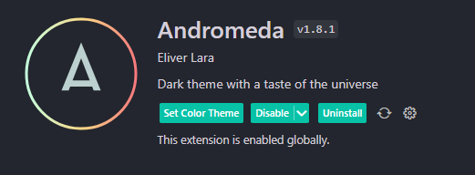
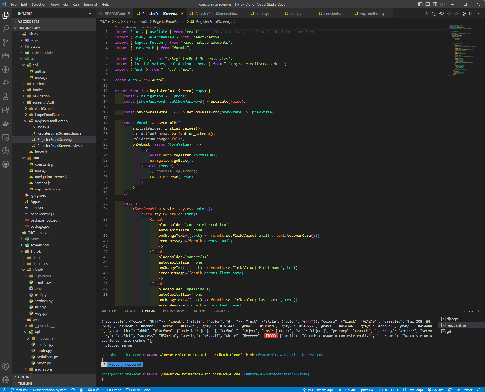

---

### Dracula Offical

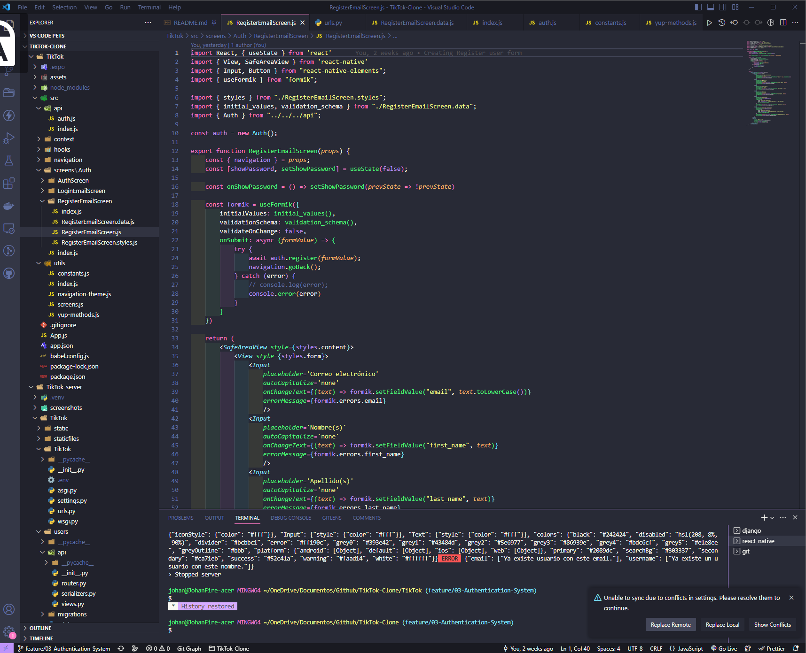

---

### Dobri Next
Dobri contains 23 colorful color themes.
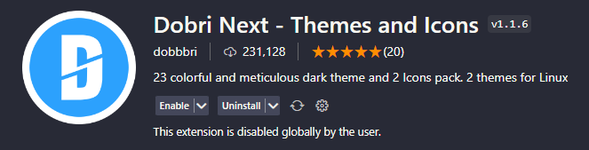
#### Dobri Next -A00- Black
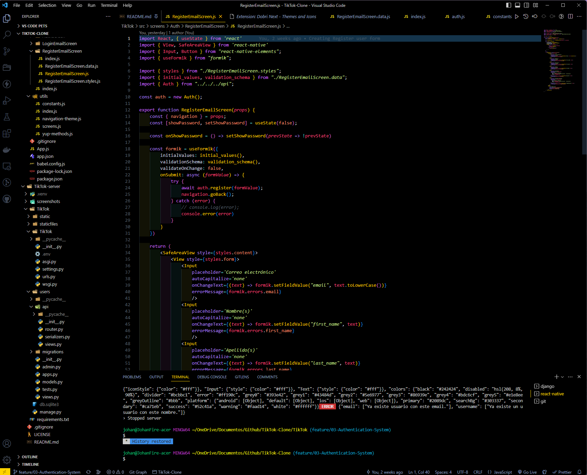
#### Dobri Next -A08- Midnight
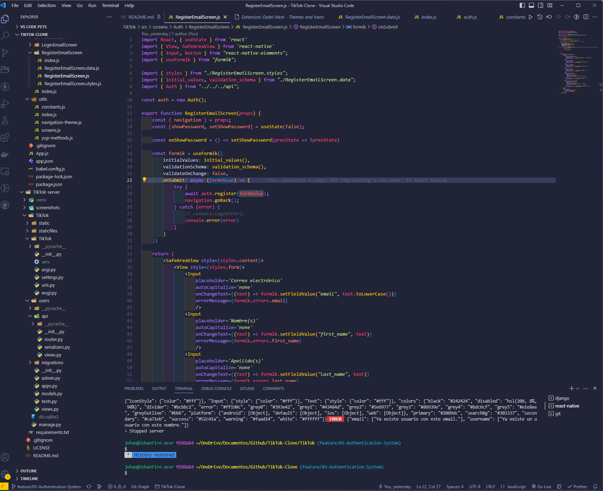
#### Dobri Next -C05- Electron
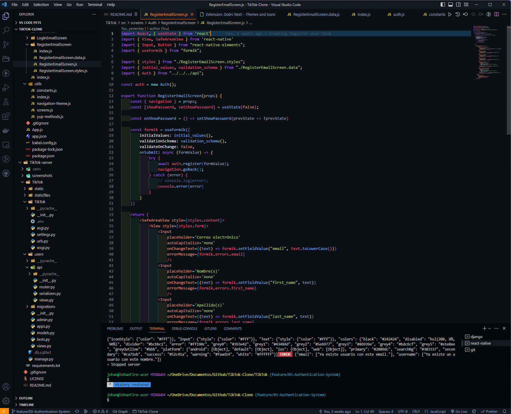

---

### Synthwave' 84
If you want to enable Neon text on this color theme, do next:  
Open the **Command Palette** with: `Ctrl + Shift + P`, and then write `Synth ...`.  
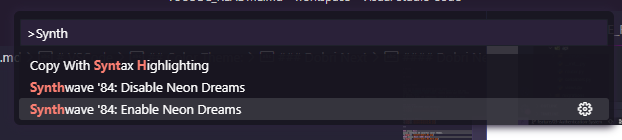

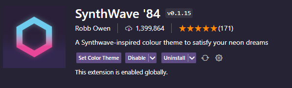

#### Neon disabled
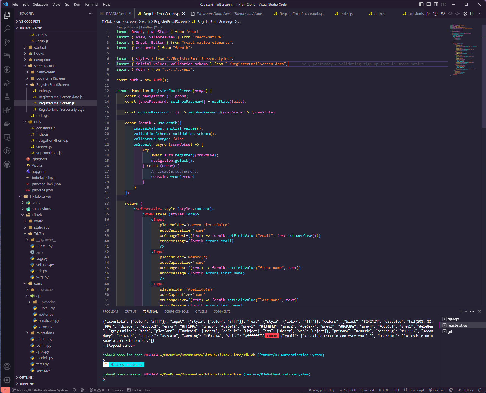
#### Neon enabled
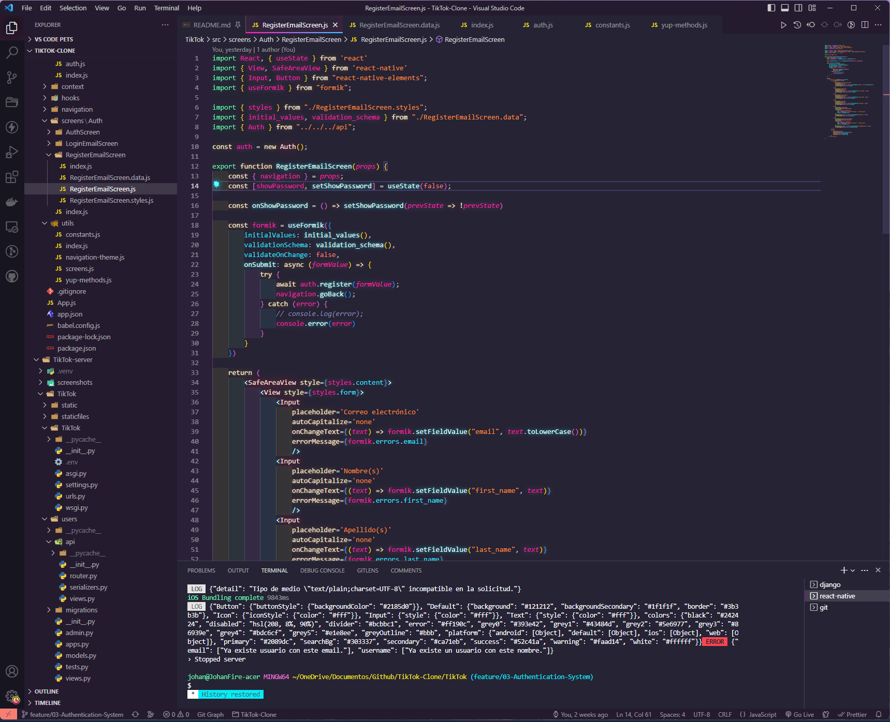